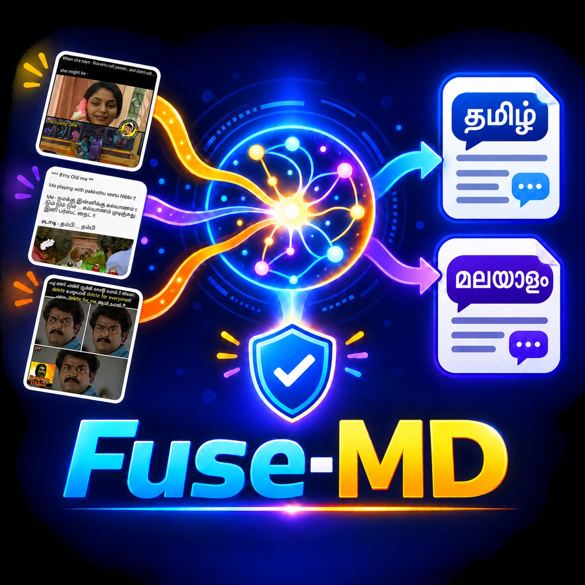

# Fuse-MD: Tamil Multimodal Meme Detection



> A research demo for detecting misogynistic content in Tamil memes by jointly analysing the image and its Tamil transcription.

**Fuse-MD** brings together visual context and language context through a fusion-based multimodal classifier. Upload a Tamil meme, enter its visible text, and receive a model prediction with a confidence score.

| Input | Model | Output |
| --- | --- | --- |
| Meme image + Tamil transcription | Tamil Fuse-MD element-fusion checkpoint | `misogyny` or `not-misogyny` with probability |

## How to use this demo

1. Upload a Tamil meme image.
2. Enter the meme's Tamil transcription in the text field.
3. Keep the default decision threshold of **0.70** or adjust it for exploratory use.
4. Select **Predict** to receive the label, probability, and inference runtime.

## Model overview

Fuse-MD combines two complementary signals:

- **Text stream:** encodes the supplied Tamil meme transcription.
- **Image stream:** encodes the uploaded meme image using a Vision Transformer backbone.
- **Element fusion:** combines text and image representations before classification.

This Space uses the Tamil element-fusion checkpoint:

```text
custom_tamil_llamavit_fusion_element_lr1e-05_epoch4_bs16_20260425_231136.pth
```

On the stored Tamil test split, this checkpoint achieved **81.46% accuracy** and **0.761 macro-F1**. The default threshold of 0.70 is the threshold selected during validation.

## Intended use and limitations

This is a **research demonstration**, not a moderation decision system. Predictions can be wrong, can reflect dataset limitations, and should not be used as the sole basis for decisions about people or content. The result depends on both the uploaded image and the accuracy of the transcription you provide.

The demo is designed for Tamil memes and may not perform reliably for other languages, unrelated image types, unclear text, or content outside the training distribution.

## Research

This implementation accompanies the paper:

> Ponnusamy, R., Rajiakodi, S., Sivagnanam, B., Kizhakkeparambil, A., Sharma, D., Buitelaar, P., & Chakravarthi, B. R. (2026). *Fuse-MD: A culturally-aware multimodal model for detecting misogyny memes*. Natural Language Processing Journal, 14, 100197.

```bibtex
@article{ponnusamy2026fusemd,
  title={Fuse-MD: A culturally-aware multimodal model for detecting misogyny memes},
  author={Ponnusamy, Rahul and Rajiakodi, Saranya and Sivagnanam, Bhuvaneswari and Kizhakkeparambil, Anshid and Sharma, Dhruv and Buitelaar, Paul and Chakravarthi, Bharathi Raja},
  journal={Natural Language Processing Journal},
  volume={14},
  pages={100197},
  year={2026},
  doi={10.1016/j.nlp.2026.100197}
}
```

## License

This Space contains components under different terms:

- **Fuse-MD source code:** [MIT License](https://opensource.org/license/mit).
- **Fuse-MD checkpoint and associated training data:** CC BY-NC-SA 4.0; provided for non-commercial academic research only.
- **MalayaLLM text backbone:** Apache-2.0; see the [model card](https://huggingface.co/VishnuPJ/MalayaLLM_7B_Base).

Do not use this Space, its checkpoint, or associated data for commercial purposes without confirming that all applicable permissions have been obtained.
